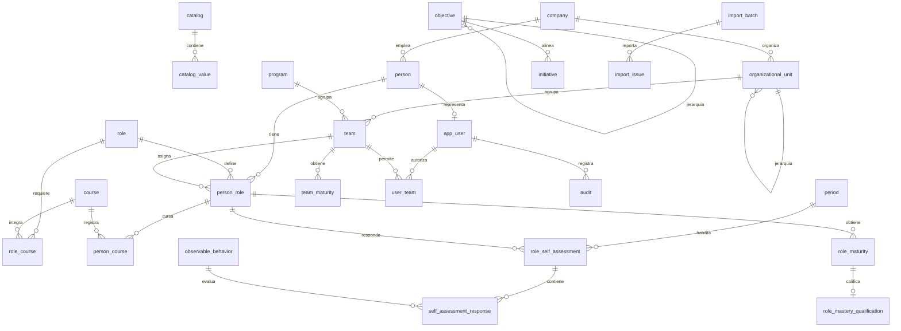

# Modelo de datos implementado — Mochelab 2.0

> Fuente de verdad: `apps/api/prisma/schema.prisma`. Este documento describe el modelo actualmente implementado para PostgreSQL; los nombres se muestran como tablas y columnas físicas (`snake_case`).

## Convenciones

- Las claves primarias son UUID, salvo las tablas puente, que usan clave primaria compuesta.
- `?` indica un campo opcional (admite `NULL`).
- Las entidades operativas incluyen `created_at` y `updated_at` salvo que se indique lo contrario.
- Los valores configurables se centralizan en `catalog` y `catalog_value`; sus claves foráneas se indican como `FK catálogo`.
- Los identificadores `source_id` y `source_row` preservan trazabilidad del origen histórico.

## Vista de relaciones

## Catálogos y estructura organizacional

| Tabla | Propósito | Campos principales y reglas |
|---|---|---|
| `catalog` | Define un catálogo configurable. | `id` UUID PK, `code` único, `name`, `description?`, `active`. |
| `catalog_value` | Valores de cada catálogo. | `id` UUID PK, `catalog_id` FK, `code`, `name`, `description?`, `sort_order`, `active`, vigencia y `metadata` JSON. Único: (`catalog_id`, `code`). |
| `company` | Empresa. | `id`, `code` único, `name`, `source_name?`, `active`. |
| `organizational_unit` | Unidad jerárquica. | `id`, `code`, `name`, `unit_type`, `parent_id?` FK a sí misma, `company_id?`, `sort_order`, `active`. Único: (`unit_type`, `code`, `company_id`). |
| `business_partner` | Socio de negocio asociado a una persona. | `id`, `code` único, `name`, `email?`, `active`. |
| `program` | Programa al que pertenece un equipo o iniciativa. | `id`, `code` único, `name`, `active`. |

## Personas, roles y aprendizaje

| Tabla | Propósito | Campos principales y reglas |
|---|---|---|
| `person` | Persona dentro de una empresa. | `id`, `dni`, `company_id` FK, `names`, contacto y posición opcionales, `occupation_level_id?` FK catálogo, `organizational_unit_id?`, `business_partner_id?`, `status_id` FK catálogo, `source_row?`. Único: (`dni`, `company_id`). |
| `role` | Rol funcional. | `id`, `source_id` único, `name`, `type_id` y `status_id` (FK catálogo). |
| `team` | Equipo. | `id`, `source_id` único, `unit_id?`, `program_id`, `status_id` (FK catálogo). |
| `person_role` | Asignación concreta de persona, rol y equipo. | `id`, `person_id`, `role_id`, `team_id`, `status_id`, `onboarding_status_id`, `start_date?`, `end_date?`, `source_row?`. Único: (`person_id`, `role_id`, `team_id`). |
| `course` | Curso disponible. | `id`, `source_id` único, `name`, `module_id`, `status_id` (FK catálogo). |
| `role_course` | Cursos requeridos por rol. | PK compuesta: (`role_id`, `course_id`); `active`. |
| `person_course` | Avance de curso de una asignación. | `id`, `person_role_id`, `course_id`, `status_id`, `score?`, fechas opcionales, `source_catalog_id?`, `group_catalog_id?`, datos de carga y `source_row?`. Único: (`person_role_id`, `course_id`). |

## Madurez y autoevaluación

| Tabla | Propósito | Campos principales y reglas |
|---|---|---|
| `period` | Periodo de evaluación. | `id`, `code` único, `name`, `start_date`, `end_date`, ventanas de autoevaluación/calibración, `configuration_version?`, `status_id`, `active`. |
| `maturity_dimension` | Dimensión de madurez. | `id`, `code` único, `name`, `description?`, `weight`, `sort_order`, `active`. |
| `observable_behavior` | Comportamiento observable de una dimensión. | `id`, `dimension_id`, `code` único, `statement`, `help_text?`, `weight`, `sort_order`, `active`. |
| `observable_behavior_role` | Aplicabilidad de un comportamiento a un rol. | PK compuesta: (`behavior_id`, `role_id`); `active`. |
| `role_self_assessment` | Autoevaluación de una asignación en un periodo. | `id`, `person_role_id`, `period_id`, `status_id`, `calculated_score?`, `configuration_version`, fechas. Único: (`person_role_id`, `period_id`). |
| `self_assessment_response` | Respuesta a un comportamiento; conserva una instantánea de la configuración. | PK: (`self_assessment_id`, `behavior_id`); `score`, `comments?`, texto, pesos y dimensión copiados al momento de responder. |
| `role_maturity` | Resultado de madurez de una asignación. | `id`, `person_role_id`, `period_id`, `self_assessment_id?` único, `evaluated_at`, `score`, puntajes de autoevaluación/calibración opcionales, `level_id`, comentarios, calibrador y trazabilidad. Único: (`person_role_id`, `period_id`). |
| `team_maturity` | Resultado de madurez por equipo y periodo. | `id`, `team_id`, `period_id`, `evaluated_at`, `score`, `level_id`, `comments?`, `source_row?`. Único: (`team_id`, `period_id`). |
| `role_mastery_qualification` | Evidencias necesarias para la calificación de maestría. | `id`, `role_maturity_id` único, persona capacitada/evidencias opcionales, verificación de capacitación y campamento, `team_maturity_id?`, revisor y comentarios. |

## Objetivos, iniciativas y metas

| Tabla | Propósito | Campos principales y reglas |
|---|---|---|
| `objective` | Objetivo corporativo o de equipo con jerarquía. | `id`, `source_id` único, `level_id`, `parent_id?` (autorreferencia), `parent_reference_legacy?`, `team_id?`, `focus_area_id`, `year`, `cycle_id`, `objective`, `key_result`, dirección/tipo/unidad, valores de línea base, meta y ejecución, estados, `achievement?`, `legacy_record`, `source_row?`. |
| `initiative` | Iniciativa de portafolio. | `id`, `source_id` único, `team_id?`, `company_id`, `year`, ciclo/área/nivel/programa, nombre y datos de ejecución, responsables, atributos de gestión y beneficio económico, `objective_id?`, trazabilidad. |
| `indicator_target` | Meta de un indicador durante una vigencia. | `id`, `source_id` único, `indicator_id`, `scope_id`, `team_id?`, `role_id?`, `valid_from`, `valid_until?`, `target`, `unit_id`, `status_id`. Índice por indicador, alcance y vigencia. |

Los atributos de clasificación de `objective`, `initiative` e `indicator_target` son referencias a `catalog_value`; `company`, `team`, `program`, `role` y `objective` usan tablas de dominio propias.

## Acceso, auditoría y comunicaciones

| Tabla | Propósito | Campos principales y reglas |
|---|---|---|
| `app_user` | Usuario de la aplicación. | `id`, `email` único, `name?`, `profile_id`, `status_id` (FK catálogo), `person_id?` único, `last_login_at?`. |
| `user_team` | Equipos accesibles por usuario. | PK compuesta: (`user_id`, `team_id`). |
| `system_module` | Módulo funcional de la aplicación. | `id`, `code` único, `name`, `description?`, `route?`, `icon?`, `sort_order`, `active`. |
| `profile_module` | Matriz de permisos perfil–módulo. | PK compuesta: (`profile_id`, `module_id`); `can_view`, `can_create`, `can_edit`, `can_delete`. |
| `audit` | Bitácora de acciones y resultados. | `id`, `source_id?` único, `occurred_at`, `user_id?`, actor heredado, acción, entidad, registro, valores anterior/nuevo JSON, resultado, error, origen y correlación. |
| `communication` | Cola/registro de comunicaciones transaccionales. | `id`, evento, canal, destinatario, asunto, plantilla, variables JSON, estado, fuente, `dedupe_key` único, referencias opcionales a asignación, periodo y solicitante, envío/error. |
| `communication_template` | Plantillas de comunicación. | `id`, `code` único, `name`, asunto/cuerpo, remitente, `active`. |

## Importación y calidad de datos

| Tabla | Propósito | Campos principales y reglas |
|---|---|---|
| `import_batch` | Ejecución de una importación. | `id`, `file_name`, `file_hash`, `importer_version`, `status`, `totals?` JSON, fechas, `created_by_id?`. Único: (`file_hash`, `importer_version`). |
| `import_issue` | Incidencia encontrada en una importación. | `id`, `import_batch_id`, hoja, fila, entidad, campo, severidad, código, descripción, valor original, resolución y fecha de resolución. |

## Integridad e índices relevantes

- Las relaciones N:M se materializan en `role_course`, `observable_behavior_role`, `user_team` y `profile_module` mediante claves compuestas.
- La jerarquía se implementa en `organizational_unit.parent_id` y `objective.parent_id`.
- Los resultados por periodo son únicos para una asignación (`role_maturity`) o equipo (`team_maturity`), y la autoevaluación también es única por asignación y periodo.
- Existen índices para consultas frecuentes por estado, periodo, equipo, objetivo, vigencias, usuario y auditoría. El detalle exacto está en el esquema Prisma.

## Fuente y actualización

Para actualizar este documento después de una migración, contrastarlo con `apps/api/prisma/schema.prisma` y las migraciones de `apps/api/prisma/migrations/`. El archivo anterior `docs/modelo-relacional.md` se conserva como antecedente de diseño, no como fuente de la implementación actual.
