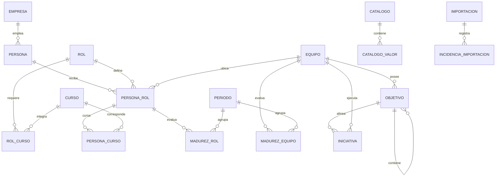

# Modelo relacional de Mochelab 2.0

Estado: propuesta para revisión antes de crear PostgreSQL.

Fuente analizada: `Data Servicios (15).xlsx`. La hoja `PersonaConcientizada` queda excluida de la migración.

## Decisiones aprobadas

- PostgreSQL será el motor de base de datos.
- Cada tabla utilizará una llave técnica interna.
- Los identificadores actuales se conservarán como identificadores de origen para trazabilidad.
- Una persona se distingue por DNI y empresa.
- `persona.id` será la llave primaria técnica.
- `persona(dni, empresa_id)` será una llave única de negocio.
- `persona_rol` y `persona_curso` se relacionarán mediante identificadores internos, no mediante DNI aislado.
- Los valores mostrados en combos serán configurables.
- La variante de origen `DANPER` se normalizará como `DANPER TRUJILLO SAC`.
- Para resolver la migración multiempresa, las asignaciones del equipo 3 se vincularán a la Persona de `DANPER TRUJILLO SAC` y las del equipo 33 a la Persona de `DOMINUS`.
- Las variantes históricas de `UNIDAD_KR` se normalizarán mediante un catálogo canónico y una tabla de alias.
- Equipo podrá contener personas de varias empresas y no tendrá una Empresa propietaria obligatoria.
- Inicialmente, solo el perfil Administrador podrá crear, editar, ordenar o inactivar valores configurables.
- Los catálogos con comportamiento propio conservarán tablas de dominio.
- Los valores utilizados históricamente se inactivarán; no se borrarán si tienen referencias.
- La migración no corregirá silenciosamente registros ambiguos o inválidos.
- Los OKR históricos con padre inválido se cargarán sin bloquear la migración; la validación estricta se aplicará a registros nuevos.

## Diagrama general

## Organización y personas

### `empresa`

Tabla propia porque participa en la identidad de Persona y en otras relaciones de negocio.

| Campo | Tipo | Regla |
|---|---|---|
| `id` | UUID | PK |
| `codigo` | varchar | Único, estable |
| `nombre` | varchar | Nombre visible |
| `estado` | varchar | Activo o inactivo |
| `origen_nombre` | varchar | Valor original de Excel |
| `created_at`, `updated_at` | timestamptz | Auditoría técnica |

La variante `DANPER` se mapeará a `DANPER TRUJILLO SAC`, conservando el valor original para trazabilidad.

### `persona`

| Campo | Tipo | Regla |
|---|---|---|
| `id` | UUID | PK técnica |
| `dni` | varchar | Obligatorio, se conserva como texto |
| `empresa_id` | UUID | FK a `empresa` |
| `nombres` | varchar | Obligatorio |
| `correo` | varchar | Opcional; no será único globalmente |
| `telefono` | varchar | Opcional |
| `posicion` | varchar | Opcional |
| `nivel_ocupacional_id` | UUID | FK a `catalogo_valor` |
| `unidad_organizacional_id` | UUID | FK a `unidad_organizacional` |
| `business_partner_id` | UUID | FK a `business_partner` |
| `estado_id` | UUID | FK a `catalogo_valor` |
| `fila_origen` | integer | Trazabilidad de migración |
| `created_at`, `updated_at` | timestamptz | Auditoría técnica |

Restricción única: `(dni, empresa_id)`.

El correo se indexará para búsqueda y detección de incidencias, pero no será único: la fuente contiene correos compartidos o repetidos.

### `unidad_organizacional`

Representa Gerencia, Subgerencia y División sin mantener tres listas independientes.

| Campo | Tipo | Regla |
|---|---|---|
| `id` | UUID | PK |
| `tipo_id` | UUID | Gerencia, Subgerencia o División |
| `codigo` | varchar | Único dentro del tipo |
| `nombre` | varchar | Nombre visible |
| `padre_id` | UUID | FK opcional a la misma tabla |
| `empresa_id` | UUID | FK opcional a `empresa` |
| `orden` | integer | Orden del combo |
| `estado` | varchar | Activo o inactivo |

### `business_partner`

| Campo | Tipo | Regla |
|---|---|---|
| `id` | UUID | PK |
| `codigo` | varchar | Único |
| `nombre` | varchar | Nombre visible |
| `correo` | varchar | Opcional |
| `estado` | varchar | Activo o inactivo |

## Capacidades y aprendizaje

### `rol`

Conserva `ID_ROL` como `origen_id` único.

Campos principales: `id`, `origen_id`, `nombre`, `tipo_id`, `estado_id`, marcas de tiempo.

### `equipo`

Conserva `ID_TEAM` como `origen_id` único.

Campos principales: `id`, `origen_id`, `unidad_id`, `programa_id`, `estado_id`, marcas de tiempo.

Equipo no tendrá una FK obligatoria a Empresa porque existen equipos con integrantes de varias empresas. Las asociaciones 3/DANPER y 33/DOMINUS son reglas de resolución para personas multiempresa durante la importación, no atributos permanentes del equipo.

### `persona_rol`

| Campo | Tipo | Regla |
|---|---|---|
| `id` | UUID | PK |
| `persona_id` | UUID | FK a `persona` |
| `rol_id` | UUID | FK a `rol` |
| `equipo_id` | UUID | FK a `equipo` |
| `estado_id` | UUID | FK configurable |
| `onboarding_estado_id` | UUID | FK configurable |
| `fecha_alta` | date | Opcional |
| `fecha_baja` | date | Opcional |
| `fila_origen` | integer | Trazabilidad |
| `created_at`, `updated_at` | timestamptz | Auditoría técnica |

Restricción única inicial: `(persona_id, rol_id, equipo_id)`.

Regla: `fecha_baja` no puede ser anterior a `fecha_alta`.

Las cinco asignaciones de los dos DNI multiempresa se vincularán según el equipo: las cuatro relaciones del equipo 33 irán a `DOMINUS` y la relación del equipo 3 irá a `DANPER TRUJILLO SAC`.

### `curso`

Conserva `ID_CURSO` como `origen_id` único.

Campos principales: `id`, `origen_id`, `nombre`, `modulo_id`, `estado_id`, marcas de tiempo.

### `rol_curso`

| Campo | Tipo | Regla |
|---|---|---|
| `rol_id` | UUID | PK parcial y FK |
| `curso_id` | UUID | PK parcial y FK |
| `estado` | varchar | Permite retirar una relación sin perder historia |
| `created_at`, `updated_at` | timestamptz | Auditoría técnica |

PK compuesta: `(rol_id, curso_id)`.

### `persona_curso`

| Campo | Tipo | Regla |
|---|---|---|
| `id` | UUID | PK |
| `persona_rol_id` | UUID | FK a la asignación concreta |
| `curso_id` | UUID | FK a `curso` |
| `estado_id` | UUID | FK configurable |
| `nota` | numeric | Opcional |
| `fecha_inicio`, `fecha_fin` | date | Opcionales |
| `fuente_id` | UUID | FK configurable |
| `grupo_id` | UUID | FK configurable |
| `fecha_carga` | timestamptz | Fecha del dato fuente |
| `usuario_carga` | varchar | Valor heredado; después será FK a usuario |
| `fila_origen` | integer | Trazabilidad |
| `created_at`, `updated_at` | timestamptz | Auditoría técnica |

Restricción única: `(persona_rol_id, curso_id)`.

Esta relación reemplaza la clave ambigua DNI + rol + curso. Los 18 cursos del rol Desarrollador se vincularán a las asignaciones del equipo 33 y, por tanto, a `DOMINUS`.

## Madurez

### `periodo`

Campos: `id`, `codigo`, `nombre`, `fecha_inicio`, `fecha_fin`, `estado`.

### `madurez_rol`

Campos principales: `id`, `persona_rol_id`, `periodo_id`, `fecha_evaluacion`, `puntaje`, `nivel_id`, `comentarios`, `fila_origen`.

Restricción única inicial: `(persona_rol_id, periodo_id)`.

### `madurez_equipo`

Campos principales: `id`, `equipo_id`, `periodo_id`, `fecha_evaluacion`, `puntaje`, `nivel_id`, `comentarios`, `fila_origen`.

Restricción única inicial: `(equipo_id, periodo_id)`.

Los niveles se calcularán con estos umbrales:

- Puntaje menor que 0.5: `1.POSTULANTE`.
- Puntaje mayor o igual que 0.5 y menor que 1.5: `2.PRINCIPIANTE`.
- Puntaje mayor o igual que 1.5 y menor o igual que 2: `3.OFICIAL`.
- Puntaje mayor que 2: `4.MAESTRO`.

Un puntaje exactamente igual a 2 permanece en `3.OFICIAL`.

## Estrategia y portafolio

### `objetivo`

Unifica objetivos corporativos y OKR de equipo, conservando la jerarquía.

| Campo | Tipo | Regla |
|---|---|---|
| `id` | UUID | PK |
| `origen_id` | bigint | Único; antiguo `ID_OKR` |
| `nivel_id` | UUID | Corporativo o Equipo |
| `padre_id` | UUID | FK opcional a `objetivo` |
| `padre_referencia_legacy` | varchar | Valor original cuando no puede resolverse la FK |
| `equipo_id` | UUID | FK opcional a `equipo` |
| `area_enfoque_id` | UUID | FK configurable |
| `anio` | smallint | Obligatorio |
| `ciclo_id` | UUID | FK configurable |
| `objetivo` | text | Obligatorio |
| `resultado_clave` | text | Obligatorio |
| `indicador` | text | Obligatorio |
| `tipo_indicador_id` | UUID | FK configurable |
| `unidad_kr_id` | UUID | FK configurable |
| `linea_base`, `meta`, `ejecutado` | numeric | Según disponibilidad |
| `fecha_base`, `fecha_corte` | date | Opcionales |
| `estado_resultado_id` | UUID | FK configurable |
| `estado_registro_id` | UUID | FK configurable |
| `cumplimiento` | numeric | Calculado por el servidor |
| `fila_origen` | integer | Trazabilidad |

Reglas:

- Un objetivo corporativo no lleva `equipo_id` ni `padre_id`.
- Un OKR de equipo requiere ambos campos.
- `padre_id` debe apuntar a un objetivo corporativo.
- Los 238 valores `#REF!` se conservarán en `padre_referencia_legacy`; `padre_id` quedará nulo y la migración continuará.
- Los registros históricos importados podrán conservar un padre no resuelto y quedarán identificados como datos heredados.
- Todo OKR de equipo creado o editado en Mochelab 2.0 deberá tener un `padre_id` válido que apunte a un objetivo corporativo.
- La API y la base bloquearán referencias nuevas inexistentes; esta excepción no se extenderá a nuevos registros.
- Los ciclos no reconocidos, como `QX`, requieren mapeo o corrección previa.

### `iniciativa`

Conserva `ID_INICIATIVA` como `origen_id` único y `ID_OKR` mediante `objetivo_id`.

Además de sus campos descriptivos, utilizará FK configurables para empresa, ciclo, área de enfoque, nivel, programa, tipo, talla, prioridad, tipo de gestión, estado, escalamiento, horizonte, capacidad TI, categoría e impacto.

Reglas:

- `fecha_fin_ejecucion` no puede ser anterior a `fecha_inicio_ejecucion`.
- Las iniciativas históricas sin OKR pueden conservar `objetivo_id` nulo.
- `release` seguirá como texto porque tiene alta cardinalidad y no funciona como catálogo estable.
- Los campos de beneficio utilizarán `numeric`, nunca texto formateado.

### `meta_indicador`

Campos principales: `id`, `origen_id`, `indicador_id`, `alcance_id`, `equipo_id`, `rol_id`, vigencias, `valor_meta`, `unidad_id`, `estado_id`.

Reglas:

- Equipo y Rol serán opcionales según el alcance.
- Se bloquearán vigencias superpuestas para la misma combinación de indicador y alcance.
- Las metas de distribución de madurez deberán sumar 100 % dentro de su conjunto aplicable.

## Catálogos configurables

### `catalogo`

| Campo | Tipo | Regla |
|---|---|---|
| `id` | UUID | PK |
| `codigo` | varchar | Único y estable |
| `nombre` | varchar | Nombre administrativo |
| `descripcion` | text | Opcional |
| `estado` | varchar | Activo o inactivo |

### `catalogo_valor`

| Campo | Tipo | Regla |
|---|---|---|
| `id` | UUID | PK |
| `catalogo_id` | UUID | FK a `catalogo` |
| `codigo` | varchar | Estable dentro del catálogo |
| `nombre` | varchar | Texto del combo |
| `descripcion` | text | Opcional |
| `orden` | integer | Orden de presentación |
| `estado` | varchar | Activo o inactivo |
| `vigencia_desde`, `vigencia_hasta` | date | Opcionales |
| `metadata` | jsonb | Propiedades adicionales justificadas |

Restricción única: `(catalogo_id, codigo)`.

Catálogos iniciales:

- Nivel ocupacional.
- Estado de persona.
- Tipo y estado de rol.
- Estado de asignación y onboarding.
- Módulo y estado de curso.
- Estado, fuente y grupo de persona-curso.
- Nivel de madurez.
- Nivel de objetivo, área de enfoque, ciclo, tipo de indicador, unidad KR y estados de objetivo.
- Tipo, talla, prioridad, tipo de gestión, estado, escalamiento, horizonte, capacidad TI, categoría e impacto de iniciativa.
- Indicador, alcance, unidad y estado de metas.
- Perfil y estado de usuario.

Para `UNIDAD_KR`, la migración utilizará `database/seeds/unidad_kr_catalogo.csv` y `database/seeds/unidad_kr_alias.csv`. Las 109 variantes históricas se transformarán en unidades canónicas. Una fecha registrada por error como unidad conservará su valor original, tendrá `unidad_kr_id` nulo y generará una advertencia no bloqueante. Los nuevos OKR solo permitirán unidades activas del catálogo.

No serán catálogos genéricos: Empresa, Unidad organizacional, Business Partner, Equipo, Programa, Rol, Curso, Periodo, Objetivo y Usuario. Tendrán tablas propias por sus relaciones o comportamiento.

## Usuarios, permisos y auditoría

El acceso funcional sigue la matriz `Perfil → Módulo → Ver / Crear / Editar /
Eliminar`. `SystemModule` define las opciones de la aplicación y
`ProfileModule` guarda los cuatro accesos por perfil. La matriz inicial y sus
reglas están descritas en `docs/control-acceso.md`.

### `usuario`

Campos: `id`, `correo`, `nombre`, `perfil_id`, `estado_id`, `ultimo_acceso`, marcas de tiempo.

No se migrarán contraseñas SHA-256. La autenticación nueva utilizará identidad corporativa; la hoja Usuario solo servirá para preparar autorizaciones iniciales.

### `usuario_equipo`

Relaciona usuarios no administradores con sus equipos permitidos. PK compuesta: `(usuario_id, equipo_id)`.

### `auditoria`

Campos: `id`, `fecha`, `usuario_id`, `accion`, `entidad`, `registro_id`, `valor_anterior` JSONB, `valor_nuevo` JSONB, `resultado`, `tipo_error`, `origen`, `correlation_id`.

Los datos históricos de `DETALLE` se conservarán en un campo `detalle_legacy`.

## Migración y control de calidad

### `importacion`

Registra archivo, fecha, hash, estado, conteos, usuario y versión del importador.

### `incidencia_importacion`

Registra importación, hoja, fila, entidad, campo, severidad, código, descripción, valor original y resolución.

### `staging_*`

Cada hoja contractual tendrá una tabla temporal de staging. El proceso será:

1. Cargar el archivo sin alterar valores originales.
2. Validar encabezados.
3. Normalizar espacios, identificadores, fechas y variantes de catálogo.
4. Registrar duplicados, huérfanos y valores no reconocidos.
5. Resolver manualmente incidencias bloqueantes; los padres históricos `#REF!` serán advertencias no bloqueantes.
6. Insertar tablas de dominio dentro de una transacción.
7. Comparar conteos e indicadores contra el archivo.
8. Marcar la importación como aprobada.

`VW_Academia` no será una tabla fuente. Se reconstruirá como vista o consulta materializada desde Persona, Asignaciones, Cursos y sus catálogos.

## Decisiones pendientes antes de crear migraciones

No quedan decisiones estructurales bloqueantes. Las excepciones históricas se conservarán como advertencias de migración y los nuevos registros usarán las reglas estrictas del modelo.
